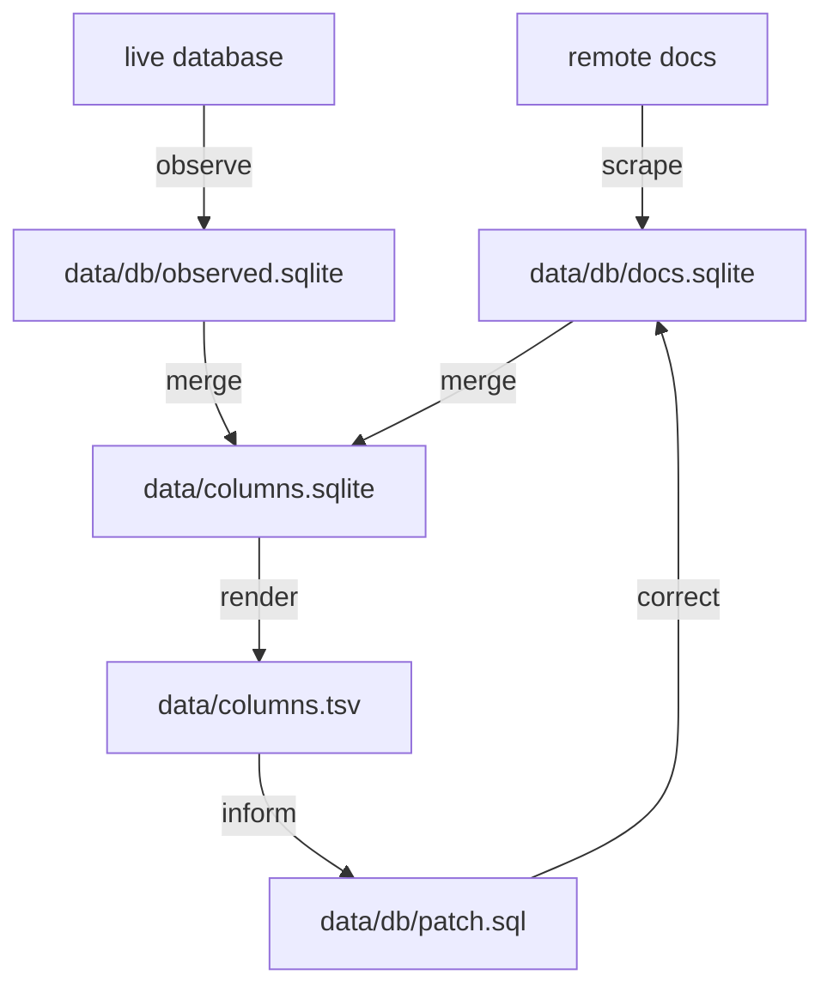

# Contributing

## Reporting incorrect information

<!-- where? issue tracker -->
As with all open-source, the only way to ensure a fix gets written is to write it yourself.

## Adding a new database

Gathering and maintaining correct, license-compliant information on a new database would take a significant amount of manual work.
Thus, adding a new database requires writing at least one of a documentation-scraper or a database-observer.

### Repo structure
Directories, files in the order you should visit them:

```tree
.
├── README.md
├── CONTRIBUTING.md
├── pkg
│   ├── common
│   │   ├── observer/*.{sql,go}
│   │   ├── schema/*.{sql,go}
│   │   └── utils/*.go
│   └── dbs
│       └── ${DB}
│           ├── docs/scraper.go
│           └── live/observer.go
├── Makefile
├── bin/* # built binaries
├── cmd/scrape_${DB}_docs/main.go
├── scripts
│   ├── scrape/${DB}_docs.sh
│   ├── observe/${DB}.sh
│   └── *.sh
├── data
│   ├── README.md
│   ├── ${DB}
│   │   ├── docs.sqlite
│   │   ├── patch.sql
│   │   └── observed.sqlite
│   ├── columns.sqlite
│   └── columns.tsv
└── dist/* # future web artifacts
```

### required development tools
- `go >= 1.17`
- `sqlite3`
- `make`
- `bash`

### Workflow



### When to add a documentation scraper
If the database's documentation is offered under a creative commons license, consider writing a new scraper for it.

### How to create a new documentation scraper

<!-- TODO: script templating new documentation scrapers! -->
<!-- TODO: use `cog` to read in the list from the PR template -->

- [ ] Check that the documentation is licensed under a Creative Commons-compatible license such as `CC BY 4.0` or `CY BY-SA 4.0`
- [ ] Create a scraper package named `docs` at `./pkg/dbs/${DB}/docs/*.go`
  - the package should be named `docs`
  - the package should export a function named `Scrape`
  <!-- that implements the common/scraper.Scrape interface -->
- [ ] Create `cmd/scrape_${DB}_docs/main.go` to run your `docs.Scrape` function 
- [ ] Create a target in `Makefile` to compile `cmd/scrape_${DB}_docs/main.go` into `bin/scrape_${DB}_docs`
- [ ] Create a target in `Makefile` to run your scraper to create `data/${DB}/docs/db.sqlite`
<!-- - [ ] Run automated documentation-updates  -->
<!-- - [ ] run automated output-updates -->
- [ ] Update the README to list support for the new database!

```diff
  .
  ├── bin
  │   ├── README.md
+ │   └── scrape_${DB}_docs
  ├── cmd
+ │   └── scrape_${DB}_docs
+ │       └── main.go
  ├── data
+ │   └── ${DB}
+ │       └── docs
+ │           ├── db.sqlite
+ │           └── patch.sql
  ├── Makefile
  ├── pkg
  │   ├── common
  │   └── dbs
+ │       └── ${DB}
+ │           └── docs
+ │               └── scraper.go
  ├── README.md
  └── scripts
      └── scrape
+         └── ${DB}_docs.sh
```

Finally, create a pull request. You'll be reminded of all the steps above.
