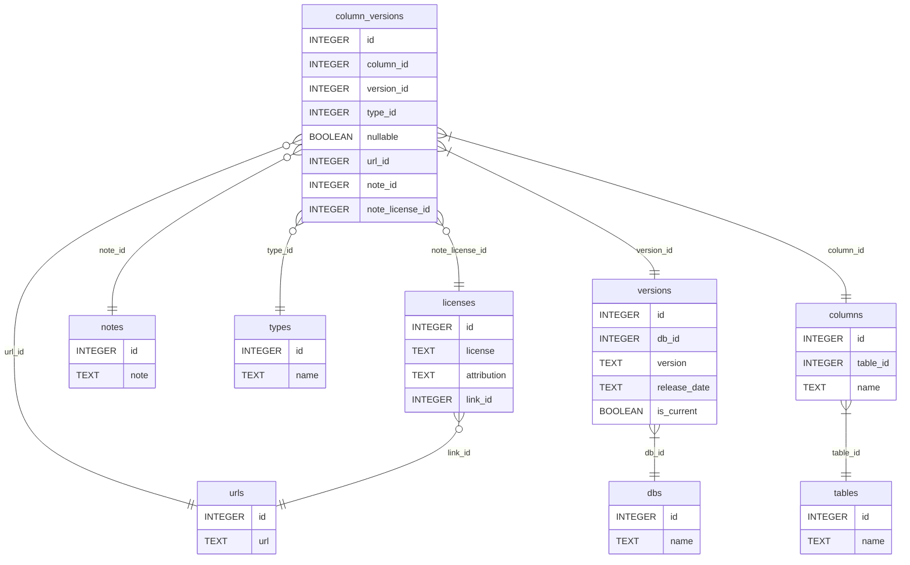

# Contributing

## Reporting incorrect information

Please report any incorrect data you see at [here](https://github.com/i-s-compat-table/i.s.compat.table/issues).

As with all open-source, the only way to ensure a fix gets written is to write it yourself.

1. If you think there's an issue in a documentation scraper, check `./cmd/${DB}/scrape_docs/main.go`.
2. Else, if you think there's an issue in the documentation that's being scraped, please try to submit the fixes to the documentation sites being scraped.
3. Else, if you think there's a problem in the aggregations producing `columns.tsv`, check [`./pkg/schema/views.sql`](`./pkg/schema/views.sql`) or [`./scripts/dump_tsv.sh`](./scripts/dump_tsv.sh).
4. Else, if the scraped data and aggregations are both correct but `columns.tsv` still looks wrong, try patching the data in `./data/${DB}/patch.sql`

## Adding a new database

Gathering and maintaining correct, license-compliant information on a new database would take a significant amount of manual work.
Thus, adding a new database requires writing at least one of a documentation-scraper or a database-observer.

### Repo structure

Directories, files in the order you should visit them:

```tree
.
├── README.md
├── CONTRIBUTING.md
├── pkg
│   └── common
│       ├── observer/*.{sql,go}
│       ├── schema/*.{sql,go}
│       └── utils/*.go
├── Makefile
├── cmd
│   └── ${DB}
│       ├── observer/*.go
│       └── scrape_docs/*.go
├── bin/* # built binaries
├── scripts
│   ├── scrape/${DB}_docs.sh
│   ├── observe/${DB}.sh
│   └── *.sh
├── data
│   ├── README.md
│   ├── ${DB}
│   │   ├── docs.sqlite
│   │   ├── patch.sql
│   │   ├── observed.sqlite
│   │   ├── merged.sqlite
│   │   └── columns.tsv
│   ├── columns.sqlite
│   └── columns.tsv
└── dist/* # future web artifacts
```

### required development tools

- `go >= 1.17`
- `sqlite3`
- `make`
- `bash`
- `docker`
- `docker-compose` (version 2 with the bridge should be ok)
- `python3.9`
- `poetry`
- several GiB of storage for database docker images.

### Workflow


Each sqlite database containing data on `information_schema` implementations has the following schema, located in [`./pkg/schema/db.sql`](./pkg/schema/db.sql):

<!-- [[[cog
  from scripts.get_mermaid_erd import get_mermaid_erd
  print("```mermaid")
  print(get_mermaid_erd())
  print("```")
]]] -->

<!-- [[[end]]] -->

### When to add a documentation scraper

If the database's documentation is offered under a creative commons license such as `cc0`, `CC-BY`, or `CC-BY-SA`, consider writing a new scraper for it.

### How to create a new documentation scraper

<!-- TODO: script templating new documentation scrapers! -->
<!-- TODO: use `cog` to read in the list from the PR template -->

- [ ] Check that the documentation is licensed under a Creative Commons-compatible license such as `CC BY 4.0` or `CY BY-SA 4.0`
- [ ] Create a scraper script at `cmd/scrape_${DB}_docs/main.go`
- [ ] Create a target in `Makefile` to compile `cmd/${DB}/scrape_docs/main.go` into `bin/scrape_${DB}_docs`
- [ ] Create a target in `Makefile` to run your scraper to create `data/${DB}/docs.sqlite`
- [ ] Update the other targets in `Makefile` to include the new dataset (i.e. `./data/${DB}/merged.sqlite` if it exists, `./data/merged.docs.sqlite`)
- [ ] Update [`./.github/workflows/scrape.yaml`](./.github/workflows/scrape.yaml) with a new doc-scraping job
- [ ] Update the README to list support for the new database!
<!-- - [ ] Commit the changes to `./data/${DB}/columns.tsv` and `./data/columns.tsv` -->

```diff
  .
  ├── cmd
+ │   └── scrape_${DB}_docs/main.go
+ ├── Makefile # add bin, docs.sqlite targets
  ├── bin
  │   ├── README.md
+ │   └── scrape_${DB}_docs # generated
  ├── data
+ │   └── ${DB}
+ │       └── docs
+ │           ├── docs.sqlite # generated
+ │           └── patch.sql
+ ├── README.md
```

Finally, create a pull request. You'll be reminded of all the steps above.

### When to create a new database-observer

When anyone has the right to spin up a local instance of the database server.
In the future, we may create observers for remote commercial databases that offer a free tier.

### How to create a new database-observer

- [ ] Check that the database docker image is licensed and available for unrestricted use
- [ ] add services to the dockerfile
- [ ] Create a target in `Makefile` to compile `cmd/${DB}/observe/main.go` into `bin/observe_${DB}`
- [ ] Create a target in `Makefile` to run your observer to create `data/${DB}/observed.sqlite`
- [ ] Update the other targets in `Makefile` to include the new dataset (i.e. `./data/${DB}/merged.sqlite` if it exists, `./data/merged.docs.sqlite`)
- [ ] Update [`./.github/workflows/scrape.yaml`](./.github/workflows/scrape.yaml) with new binary-compilation steps and a new db-observation job
<!-- - [ ] Commit the changes to `./data/${DB}/columns.tsv` and `./data/columns.tsv` -->
